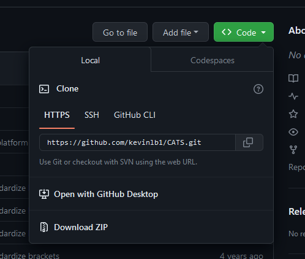
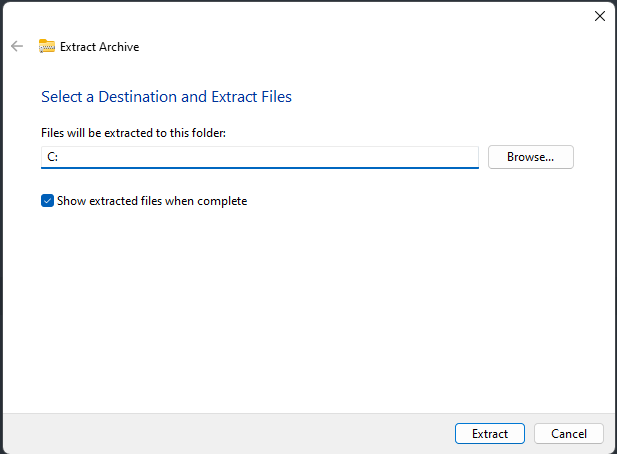
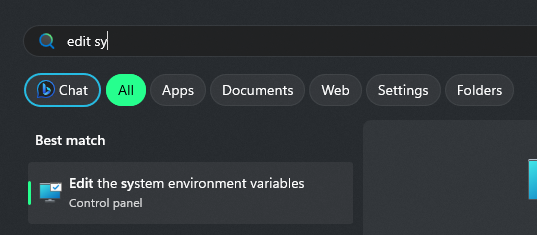
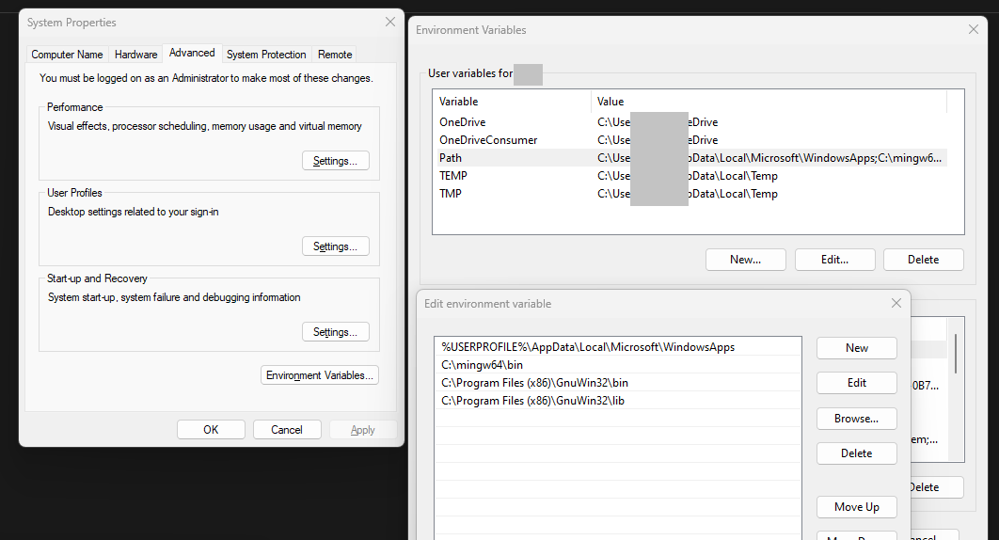

# Setup in Windows (11)


### Step 0: Prerequisites

Before proceeding, ensure that the following tools are installed on your system. 
Run the following commands in a terminal separately to check:
```bash
	gcc --version
	make --version
	bison --version
	m4 --version
	flex --version
	git --version
```
If any of these are missing, follow the next steps, otherwise proceed to [Step 1](#step-1-download-cats-from-github).

#### Step 0.1: Install the requirements

Depending on your output in the previous step, install the missing requirements:

##### Install ``gcc``

Download the newest version of ``gcc`` from [WinLibs](https://winlibs.com/).



Extract the downloaded ``.zip`` file to the home directory (Remove everything after C:).



##### Install ``make``, ``bison``, ``m4``, ``flex``

Download the newest version of ``make``, ``bison``, ``m4``, and/or ``flex``  from "sourceforge.net":

- [Make for Windows](https://gnuwin32.sourceforge.net/packages/make.htm)
- [Bison for Windows](https://gnuwin32.sourceforge.net/packages/bison.htm)
- [Flex for Windows](https://gnuwin32.sourceforge.net/packages/flex.htm)
- [m4 for Windows](https://gnuwin32.sourceforge.net/packages/m4.htm)

Choose the option ``Complete package, except sources`` and follow the installer(s).

If you installed ``bison`` or ``m4``, navigate to ``C:\Program Files (x86)\GnuWin32\bin`` and rename the ``bison.exe`` to ``bison_old.exe``.
Download the modified Bison executable from [free.fr](http://marin.jb.free.fr/bison/) (At the bottom of the page) and replace ``bison.exe`` in the same folder.

You can now proceed to step 0.1 and / or install git first.

##### Install ``git``

Git is recommended but not necessary. 
Install it by downloading the "Standalone Installer" from [git-scm.com](https://git-scm.com/download/win). 
If you choose not to use git, choose the second option in [Step 1](#step-1-download-cats-from-github).

#### Step 0.1: Update ``PATH`` variable

Open the system environment editor via Windows search:



Navigate to "Environment Variables..." and "Path".
Ensure that the following paths are specified:
```
	C:\mingw64\bin
	C:\Program Files (x86)\GnuWin32\bin
	C:\Program Files (x86)\GnuWin32\lib
```



### Step 1: Download CATS from GitHub

Open your terminal and run the following command:
```bash
	git clone https://github.com/kevinlb1/CATS.git
	cd CATS 
```
If you chose not to use git, open [Github](https://github.com/kevinlb1/CATS), click on "Code" and "Download ZIP".


Move the file to your desired installation folder and extract it.


### Step 2: Configure CATS for use in Windows

Open the File Explorer, navigate to the "CATS" folder (per default in "C:\Users\your-username"), from now on called ``CATS_HOME``.

#### Step 2.1: Change the ``Makefile``

Note: The CATS program supports compilation with ``IBM CPLEX``, a powerful tool recommended by the author, especially for larger and more complex calculations. 
However, this tutorial prioritizes simplicity in the compilation process. 
To achieve this, we demonstrate an alternative method that does not require a commercial or educational license for IBM CPLEX.
By default, CATS uses IBM CPLEX, so we'll guide you through changing the configuration to use the ``LPSOLVE`` library instead.


Rename the existing "Makefile" in ``CATS_HOME`` to "Makefile_old".
Download the provided [Makefile](/Ressources/Makefile) and move it to ``CATS_HOME``.
You can also perform the changes done in this file, i.e.:

- replacing ``;`` by ``&`` following Windows command structure
- changing to use of ``LPSOLVE`` instead of ``IBM CPLEX``.

#### Step 2.2: Correct time conversion error

To prevent an compilation error open ``BidSet.cpp`` in ``CATS_HOME`` with an text editor.
Change line 560 from
```cpp
	char* time_str = ctime(&time_buf);
```
to
```cpp
    char* time_str = ctime(reinterpret_cast<const time_t*>(&time_buf));
```

Save the changes.

#### Step 2.3: Correct double definition of max function

For another compilation error open ``Param.cpp`` and change line 16 from
```cpp
	#define max(a,b) (a>b?a:b)
```
to
```cpp
    // #define max(a,b) (a>b?a:b)
```

and save again.


#### Step 2.4: Prevent GCC library error

Open the folder ``lp_solve_4.0`` in  ``CATS_HOME`` and change line 37 from:
```cpp
	LEXLIB= -lfl
```
to
```cpp
	LEXLIB=
```

### Step 3: Compile the program

Open a terminal in ``CATS_HOME`` (Right Click &rarr; Open in Terminal) and execute:
```bash
	make -i
```
The following errors will ocur:
```
	bison -y -d lp.y
	mv y.tab.c lp.c
	process_begin: CreateProcess(NULL, mv y.tab.c lp.c, ...) failed.
	make (e=2): The system cannot find the file specified.
```

```
	flex -l lex.l
	mv lex.yy.c lex.c
	process_begin: CreateProcess(NULL, mv lex.yy.c lex.c, ...) failed.
	make (e=2): The system cannot find the file specified.
```
Perform the renamings manually:
```batch
	move .\lp_solve_4.0\y.tab.c .\lp_solve_4.0\lp.c
	move .\lp_solve_4.0\lex.yy.c .\lp_solve_4.0\lex.c
```
Retry the ``make`` command without the flag ``-i``, which will now be successful. 
```bash
	make
```

If there are still some errors, make sure you have installed all requirements mentioned in [Step 0](#step-0-prerequisites) or look at the [known problems](#known-problems).


### Step 4: Test the execution of the program

Test the execution of the program with a random generation of test files by executing in a terminal:
```bash
	./cats.exe -d arbitrary -goods 5 -bids 10     
```

If the output resembles the provided example, the setup was successful and you can continue with the [Output Explanation](/Output-Explanation.md)
```
	Number of non-dominated bids: 10  Number of bidders: 12
	CATS running 1 of 1....

	Goods: 5
	Bids: 10
	Distribution: arbitrary
	Runs: 1
	Seed: 1700762199

	Arbitrary Distribution Parameters:
	Max Substitutable Bids = 5
	Removing HV Neighbor   = 0.1
	Adding DIAG Neighbor   = 0.2
	Additional Location    = 0.9
	Additivity             = 0.2
	Budget Factor          = 1.5
	Resale Factor          = 0.5
	Normal Private Value:
	  Mean                 = 0
	  Standard Deviation   = 30


	Wrote CATS output file "0000.txt".
```


### Known problems

The most common problems that can ocur during following this tutorial:

#### Commands using ``;`` instead of ``&``.

Error message:
```
	The system cannot find the path specified.
```
Solution:
Perform [Step 2.1](#step-21-change-the-makefile).


#### Using ``IBM CPLEX`` instead of ``LPSOLVE``.

Error message:
```
	../featureCalc.h:5:10: fatal error: cplex.h: No such file or directory
    	5 | #include <cplex.h>
      	|          ^~~~~~~~~
```
Solution:
Perform [Step 2.1](#step-21-change-the-makefile).

#### ``m4``: File not found
	
Error message:
```
	m4: cannot open Files': No such file or directory
	m4: cannot open(x86)GnuWin32/share/bison': No such file or directory
	m4: cannot open C:\Program': No such file or directory
	m4: cannot openFiles': No such file or directory
	m4: cannot open `(x86)GnuWin32/share/bison/m4sugar/m4sugar.m4': No such file or directory
```
Solution:
Perform the extra steps from the installation of [``bison``](#install-make-bison-m4-flex).

#### Compile error "Time conversion"

Error message:
```
	../BidSet.cpp:560:28: error: cannot convert 'long int*' to 'const time_t*' {aka 'const long long int*'}
  	  560 |     char* time_str = ctime(&time_buf);
      	  |                            ^~~~~~~~~
      	  |                            |
     	  |                            long int*
```
Solution:
Perform [Step 2.2](#step-22-correct-time-conversion-error).

#### Compile error "Double definition of max function"

Error message:
```
	C:/mingw64/include/c++/13.2.0/limits:321:11: error: macro "max" requires 2 arguments, but only 1 given
  	  321 |       max() _GLIBCXX_USE_NOEXCEPT { return _Tp(); }
      	  |
```
or 
```
	../Param.cpp:16:18: error: expected unqualified-id before '(' token
   	   16 | #define max(a,b) (a>b?a:b)
      	  |
```
or similar.

Solution:
Perform [Step 2.3](#step-23-correct-double-definition-of-max-function).

#### GCC library error

Error message:
```
	gcc -o demo -O3 -Wall -pedantic -ansi demo.o liblpk.a -lfl -lm
	C:/mingw64/bin/../lib/gcc/x86_64-w64-mingw32/13.2.0/../../../../x86_64-w64-mingw32/bin/ld.exe: cannot find -lfl: No such file or directorycollect2.exe: error: ld returned 1 exit status
```
Solution:
Perform [Step 2.4](#step-24-prevent-gcc-library-error).

#### Linux command errors

Error message:
```
	bison -y -d lp.y
	mv y.tab.c lp.c
	process_begin: CreateProcess(NULL, mv y.tab.c lp.c, ...) failed.
	make (e=2): The system cannot find the file specified.
```
or
```
	flex -l lex.l
	mv lex.yy.c lex.c
	process_begin: CreateProcess(NULL, mv lex.yy.c lex.c, ...) failed.
	make (e=2): The system cannot find the file specified.
```
Solution:
Perform [Step 3](#step-3-compile-the-program).


